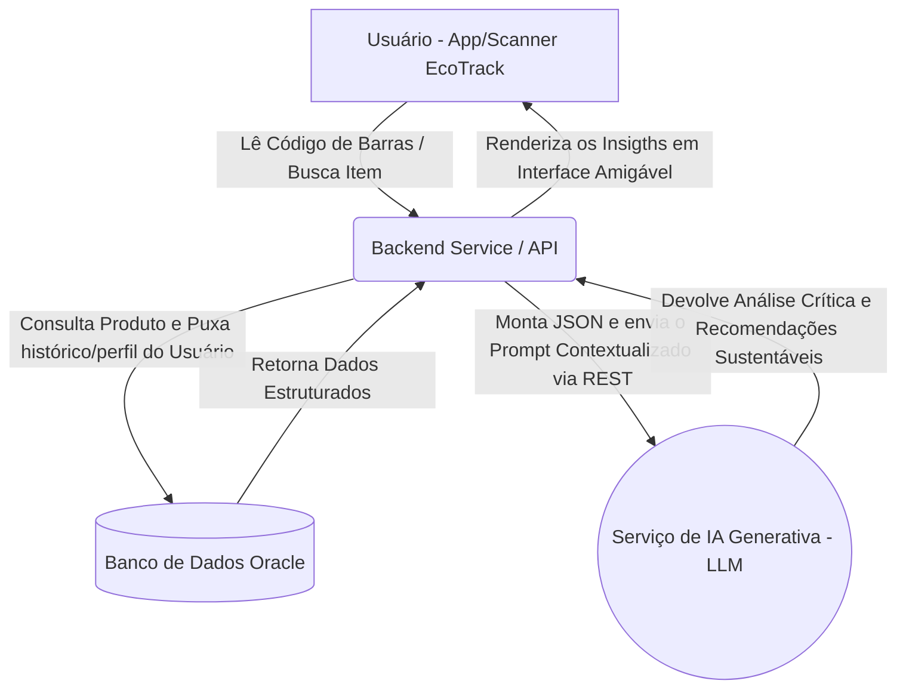

# 🌱 EcoTrack  
### Projeto Integrador: Disruptive Architectures (IoT, IoB & Generative IA)

---

## 🧭 Visão Geral do EcoTrack
O **EcoTrack** é uma solução voltada para os consumidores brasileiros que enfrentam dificuldade em decifrar rapidamente os impactos nutricionais e ambientais dos produtos do seu dia a dia. Ao invés de informações dispersas, o usuário pode **escanear e buscar produtos** e, imediatamente, **descobrir se aquilo faz mal à sua saúde ou ao meio ambiente**.

Através de **Inteligência Artificial Generativa**, o aplicativo centraliza informações como a composição nutricional, impacto ambiental das embalagens e cruza isso com as restrições alimentares do usuário para recomendar **alternativas mais inteligentes, saudáveis e sustentáveis**.

---

## 👥 Integrantes
| RM | Nome |
|----|------|
| RM560685 | Gustavo Dantas |
| RM560262 | Paulo Neto |
| RM559906 | Davi Vasconcelos Souza |

---

## 🧠 Solução de Inteligência Artificial Adotada

### O Problema
Não basta extrair os ingredientes de um banco de dados, é necessário **traduzir a teoria para a prática humana**. Pessoas comuns não sabem o impacto real do "Óleo de Palma" ou do "Excesso de Sódio e Nitratos", nem sempre percebem a pegada ambiental de certas escolhas ou como aquilo confronta suas restrições (IoB - Internet of Behavior).

### O Modelo (IA Generativa - LLM)
Nós utilizamos uma abordagem baseada em Modelos de Linguagem Extensos (**LLMs**, via integrações de API). Devido à complexidade de cruzar o Perfil do Usuário com as Características do Produto, a IA Generativa é fundamental. Ela gera:
- **Resumos dinâmicos** sobre o risco para a saúde e meio ambiente.
- **Sugestões ativas de produtos alternativos** (Por exemplo: o sistema recomenda outra bolacha caso encontre ingredientes alérgenos ao usuário naquela pesquisa).

---

## 🛠️ Entregas e Documentação Exigida

Todo o ecossistema de documentação da arquitetura e especificações do projeto de IA (Critérios Avaliativos) se encontra estruturado na pasta de **Docs**:

- 📝 [**Documentação Detalhada de Arquitetura IA**](./Docs/IA_Architecture.md) (Contém o Escopo de Dados, Fluxos, JSONs e Justificativas Completas)
- 🎤 [**Roteiro de Pitch e Apresentação**](./Docs/Roteiro_Pitch.md)

---

## 🏗️ Arquitetura de Comunicação (App, DB e IA)

O ecossistema dispensa regras engessadas e se baseia na extração inteligente de conhecimento (_In-Context Prompts_):



---

## 🧰 Tecnologias Envolvidas
| Categoria | Tecnologia | Aplicação no Projeto |
|-----------|-----------|--------------------|
| **Frontend/App** | Web/Mobile | Interface do usuário e Edge Hub de leitura IoT (câmera) |
| **Backend/Cloud** | .NET API / Oracle Ecosystem | Orquestração dos dados e regras de negócio |
| **Database** | Oracle Database | Armazenamento de perfil do usuário (IoB), consumo e restrições. |
| **Inteligência Artificial** | IA Generativa (LLM) | Geração de respostas, análises sistêmicas e recomendações naturais. |

---

## 🧱 Próximos Passos e Crescimento
- Integração refinada do OCR/Barcode scanning da câmera mobile para enviar os códigos ao Backend.
- Melhorar o perfil *Internet of Behavior (IoB) * do banco de dados (guardando o histórico e evolução na escolha do consumidor para a IA ficar ainda mais assertiva nas próximas dicas de compras).
- Conectar painéis B2B (Módulo Admin/Varejo) para supermercados lerem estatisticamente as sugestões que as IAs dão para os consumidores que compram com eles.

---

## 📷 Nova Implementação: Escaneamento e Busca por Código de Barras

O protótipo agora conta com uma forma mais prática de consulta de produtos por **código de barras**, aproximando a experiência de um scanner real de mercado.

Principais funcionalidades adicionadas:

- **Consulta por imagem do código de barras:** o usuário pode anexar uma imagem ou tirar uma foto pelo celular usando o seletor de arquivos do navegador.
- **Leitura automática do código:** após a imagem ser enviada, o sistema tenta identificar automaticamente o número do código de barras, sem exigir uma etapa manual extra.
- **Busca direta na Open Food Facts:** quando o código é reconhecido, o aplicativo consulta a API pública da Open Food Facts para recuperar dados do produto, como nome, marca, ingredientes, NutriScore, EcoScore, embalagem e categorias.
- **Campo manual de apoio:** caso a leitura por imagem não funcione por iluminação, foco ou reflexo, o usuário ainda pode digitar o número impresso abaixo do código de barras.
- **Busca local por nome ou marca:** além do fluxo por código, a aplicação mantém a busca manual no CSV local, permitindo localizar produtos mesmo quando o código não estiver cadastrado na API.
- **Leitura aprimorada por múltiplos motores:** a aplicação utiliza bibliotecas de visão computacional e leitura de barcode, incluindo OpenCV, Pyzbar e ZXing, aumentando a chance de reconhecimento em fotos reais.
- **Integração com a análise EcoTrack:** após encontrar o produto, os dados são enviados para a lógica de análise, que cruza NutriScore, EcoScore, ingredientes, embalagem e perfil do usuário para gerar o relatório personalizado.

Essa implementação melhora a usabilidade do EcoTrack em dispositivos móveis e torna o processo de consulta mais próximo do comportamento esperado em uma solução IoT/IoB aplicada ao consumo consciente.

---

## Como rodar a versao com mock de IA e camera

1. Instale as dependencias:

```bash
pip install -r requirements.txt
```

2. Rode o app:

```bash
streamlit run app.py
```

3. Para usar a camera do celular:

- Conecte computador e celular na mesma rede Wi-Fi.
- Abra no celular a URL de rede exibida pelo Streamlit, por exemplo `http://192.168.x.x:8501`.
- Permita o acesso a camera e fotografe o codigo de barras com boa luz.
